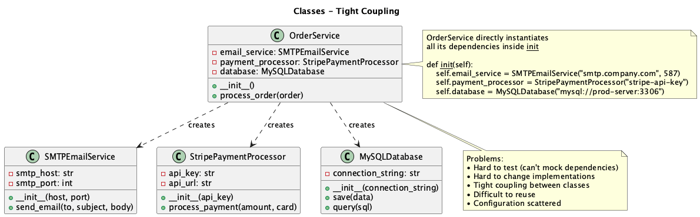
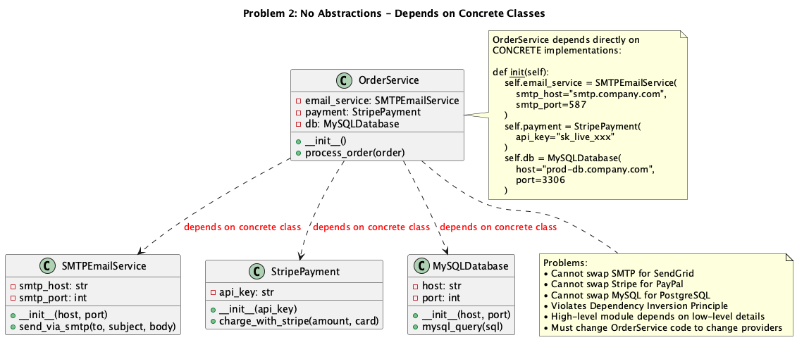
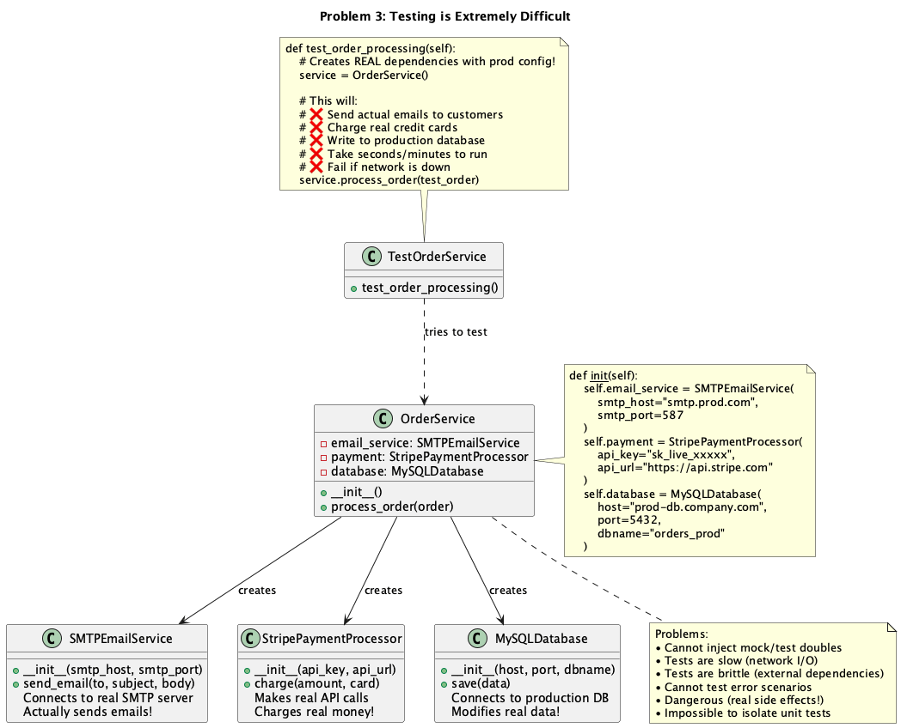
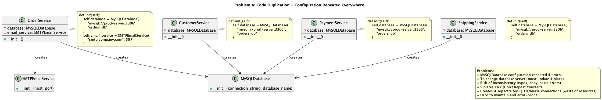
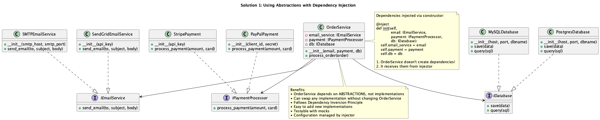
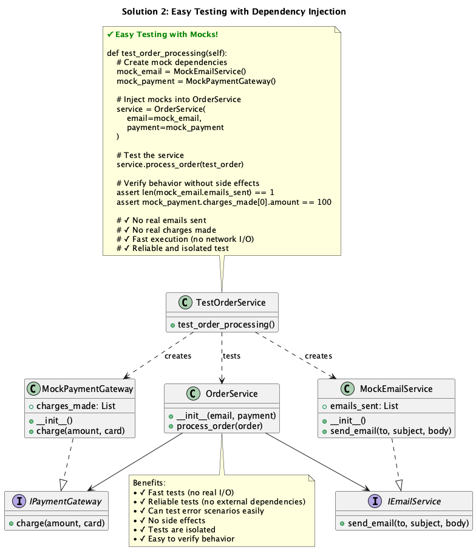
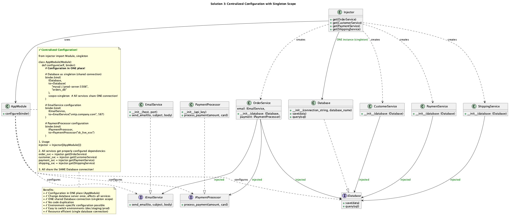

# Dependency Injection: Understanding the Problems and Solutions

**A Language-Agnostic Guide**

---

## Table of Contents

1. [Introduction](#introduction)
2. [What is a Dependency?](#what-is-a-dependency)
3. [Problems Without Dependency Injection](#problems-without-dependency-injection)
   - [Problem 1: Tight Coupling](#problem-1-tight-coupling)
   - [Problem 2: Depending on Concrete Implementations](#problem-2-depending-on-concrete-implementations)
   - [Problem 3: Testing Becomes Impossible](#problem-3-testing-becomes-impossible)
   - [Problem 4: Configuration Duplication](#problem-4-configuration-duplication)
4. [The Solution: Dependency Injection](#the-solution-dependency-injection)
   - [Solution 1: Program to Interfaces](#solution-1-program-to-interfaces)
   - [Solution 2: Enable Easy Testing](#solution-2-enable-easy-testing)
   - [Solution 3: Centralize Configuration](#solution-3-centralize-configuration)
5. [Benefits Summary](#benefits-summary)
6. [Conclusion](#conclusion)

---

## Introduction

When building software applications, classes and modules rarely work in isolation. They need to collaborate with other components to accomplish their work. These collaborators are called **dependencies**.

**The Traditional Approach:** Classes create and manage their own dependencies internally.

**The Problem:** This creates tight coupling, makes testing difficult, and leads to inflexible, hard-to-maintain code.

**The Solution:** Dependency Injection - a design pattern where dependencies are provided to a class from the outside, rather than created internally.

This guide explains the core problems with traditional dependency management and how dependency injection solves them, **without reference to any specific programming language**.

---

## What is a Dependency?

A **dependency** is any object or service that a class needs to perform its work.

### Example Scenario

Consider an `OrderService` class that processes customer orders:

- It needs an **SMTPEmailService** to send confirmation emails
- It needs a **StripePaymentProcessor** to charge the customer
- It needs a **MySQLDatabase** to save order records

In this case:
- `OrderService` **depends on** `SMTPEmailService`
- `OrderService` **depends on** `StripePaymentProcessor`
- `OrderService` **depends on** `MySQLDatabase`

---

## Problems Without Dependency Injection

### Problem 1: Tight Coupling



#### The Problem

When a class creates its own dependencies, it becomes **tightly coupled** to those specific implementations. The class must know:
- What concrete classes to instantiate
- What configuration parameters to provide
- How to construct the dependencies

#### Conceptual Example

```
CLASS OrderService:
    CONSTRUCTOR():
        // OrderService creates its own dependencies
        this.emailService = NEW SMTPEmailService("smtp.company.com", 587)
        this.paymentProcessor = NEW StripePaymentProcessor("stripe-api-key")
        this.database = NEW MySQLDatabase("mysql://prod-server:3306")
    
    METHOD processOrder(order):
        this.paymentProcessor.charge(order.amount, order.card)
        this.emailService.sendEmail(order.customer, "Order Confirmed")
        this.database.save(order)
```

#### What's Wrong?

- ❌ **Hard to change:** To switch from SMTP to SendGrid, you must modify `OrderService`
- ❌ **Hard to test:** Cannot replace real email/payment services with test doubles
- ❌ **Tight coupling:** `OrderService` knows too much about its dependencies
- ❌ **Inflexible:** Cannot reuse `OrderService` with different implementations
- ❌ **Configuration scattered:** API keys and connection strings hardcoded everywhere

#### Real-World Impact

- Changing email providers requires touching every class that sends emails
- Cannot run tests without a real database connection
- Configuration changes ripple through the entire codebase

---

### Problem 2: Depending on Concrete Implementations



#### The Problem

Without dependency injection, classes depend directly on **concrete implementations** rather than **abstractions** (interfaces/contracts). This violates a fundamental principle: **Depend on abstractions, not concretions**.

#### Conceptual Example

```
CLASS OrderService:
    CONSTRUCTOR():
        // Depends on SPECIFIC concrete classes
        this.emailService = NEW SMTPEmailService("smtp.company.com", 587)
        this.payment = NEW StripePaymentProcessor("sk_live_xxx")
        this.database = NEW MySQLDatabase("prod-db", 3306)
```

#### What's Wrong?

- ❌ **Cannot swap SMTP for SendGrid** without changing `OrderService` code
- ❌ **Cannot swap Stripe for PayPal** without changing `OrderService` code
- ❌ **Cannot swap MySQL for PostgreSQL** without changing `OrderService` code
- ❌ **Violates Dependency Inversion Principle:** High-level modules depend on low-level details
- ❌ **Must modify source code** to change providers
- ❌ **Difficult to extend:** Adding new payment providers requires code changes

#### The Core Issue

`OrderService` depends on **HOW** things work (SMTP protocol, Stripe API, MySQL syntax) instead of **WHAT** they do (send emails, process payments, store data).

---

### Problem 3: Testing Becomes Impossible



#### The Problem

When classes create their own dependencies, you **cannot substitute test doubles** (mocks/stubs). Tests will use real dependencies with real side effects.

#### Conceptual Test Example (DANGEROUS!)

```
TEST processOrderTest():
    // Creates REAL dependencies with production configuration!
    service = NEW OrderService()
    testOrder = createTestOrder()
    
    // This will:
    // ❌ Send actual emails to real customers
    // ❌ Charge real credit cards
    // ❌ Write to production database
    // ❌ Take seconds/minutes to execute
    // ❌ Fail if network is unavailable
    service.processOrder(testOrder)
    
    // How do we verify it worked?
    // We can't check the mock - there are no mocks!
```

#### What's Wrong?

- ❌ **Cannot inject mocks:** No way to provide test doubles
- ❌ **Tests are slow:** Real network I/O takes time
- ❌ **Tests are fragile:** External services can fail
- ❌ **Cannot test error scenarios:** Cannot simulate network failures or API errors
- ❌ **Dangerous side effects:** Real emails sent, real charges made, real data modified
- ❌ **Tests aren't isolated:** One test can affect another

#### Real-World Consequences

- Developers avoid writing tests because they're too slow or dangerous
- Tests require complex setup with real databases and external services
- Test failures don't clearly indicate what's broken
- Cannot test edge cases and error conditions

---

### Problem 4: Configuration Duplication



#### The Problem

Without centralized dependency management, the same configuration must be repeated in every class that uses a dependency.

#### Conceptual Example

```
CLASS OrderService:
    CONSTRUCTOR():
        // OrderService creates its own database connection
        this.database = NEW MySQLDatabase("mysql://prod-server:3306", "orders_db")
        this.emailService = NEW SMTPEmailService("smtp.company.com", 587)

CLASS CustomerService:
    CONSTRUCTOR():
        // CustomerService duplicates the same database configuration!
        this.database = NEW MySQLDatabase("mysql://prod-server:3306", "orders_db")

CLASS PaymentService:
    CONSTRUCTOR():
        // PaymentService duplicates it again!
        this.database = NEW MySQLDatabase("mysql://prod-server:3306", "orders_db")

CLASS ShippingService:
    CONSTRUCTOR():
        // ShippingService also duplicates it!
        this.database = NEW MySQLDatabase("mysql://prod-server:3306", "orders_db")
```

#### What's Wrong?

- ❌ **Database configuration repeated 4 times**
- ❌ **To change database server, must update 4 places**
- ❌ **Risk of inconsistency:** One class might have a typo in the connection string
- ❌ **Violates DRY (Don't Repeat Yourself) principle**
- ❌ **Creates 4 separate Database connections:** Inefficient resource usage
- ❌ **Difficult to maintain:** Changes must be synchronized across multiple locations

#### Real-World Impact

- Database connection strings scattered across dozens of files
- Email server configurations duplicated everywhere
- API keys repeated in multiple classes
- Changing configuration requires searching the entire codebase
- Inconsistent configurations lead to bugs

---

## The Solution: Dependency Injection

Dependency Injection (DI) is a design pattern that solves all these problems by **providing dependencies from outside** rather than creating them internally.

### Core Principle

> "Don't create your dependencies - receive them as parameters"

Instead of classes creating dependencies, they declare what they need, and a DI container/framework provides the dependencies.

---

### Solution 1: Program to Interfaces



#### The Solution

Classes depend on **abstractions** (interfaces/contracts) rather than concrete implementations. Dependencies are **injected** through the constructor.

#### Conceptual Example

```
// Define contracts (interfaces)
INTERFACE IEmailService:
    METHOD sendEmail(to, subject, body)

INTERFACE IPaymentProcessor:
    METHOD processPayment(amount, card)

INTERFACE IDatabase:
    METHOD save(data)
    METHOD query(sql)

// Concrete implementations
CLASS SMTPEmailService IMPLEMENTS IEmailService:
    CONSTRUCTOR(host, port):
        this.host = host
        this.port = port
    
    METHOD sendEmail(to, subject, body):
        // Implementation

CLASS SendGridEmailService IMPLEMENTS IEmailService:
    CONSTRUCTOR(apiKey):
        this.apiKey = apiKey
    
    METHOD sendEmail(to, subject, body):
        // Implementation

// OrderService with Dependency Injection
CLASS OrderService:
    CONSTRUCTOR(emailService: IEmailService, 
                payment: IPaymentProcessor,
                database: IDatabase):
        // Dependencies are INJECTED, not created!
        this.emailService = emailService
        this.payment = payment
        this.database = database
    
    METHOD processOrder(order):
        this.payment.processPayment(order.amount, order.card)
        this.emailService.sendEmail(order.customer, "Order Confirmed")
        this.database.save(order)
```

#### Benefits

- ✅ **OrderService depends on ABSTRACTIONS, not implementations**
- ✅ **Can swap any implementation without changing OrderService**
- ✅ **Follows Dependency Inversion Principle**
- ✅ **Easy to add new implementations** (new email providers, payment gateways)
- ✅ **Configuration managed externally**
- ✅ **Truly reusable code**

#### How It Works

1. `OrderService` declares it needs an `IEmailService` (interface)
2. The DI container provides a concrete implementation (SMTP or SendGrid)
3. `OrderService` doesn't know or care which implementation it receives
4. To switch implementations, configure the DI container - no code changes!

---

### Solution 2: Enable Easy Testing



#### The Solution

With dependency injection, testing becomes trivial because you can inject **mock objects** instead of real dependencies.

#### Conceptual Test Example (SAFE!)

```
// Create mock dependencies
CLASS MockEmailService IMPLEMENTS IEmailService:
    emailsSent = []
    
    METHOD sendEmail(to, subject, body):
        this.emailsSent.add({to, subject, body})

CLASS MockPaymentProcessor IMPLEMENTS IPaymentProcessor:
    chargesMade = []
    
    METHOD processPayment(amount, card):
        this.chargesMade.add({amount, card})

// Test with mocks
TEST processOrderTest():
    // Inject mock dependencies
    mockEmail = NEW MockEmailService()
    mockPayment = NEW MockPaymentProcessor()
    mockDatabase = NEW MockDatabase()
    
    service = NEW OrderService(mockEmail, mockPayment, mockDatabase)
    
    // Test the service
    testOrder = createTestOrder(amount=100, customer="test@example.com")
    service.processOrder(testOrder)
    
    // Verify behavior without side effects
    ASSERT mockEmail.emailsSent.length == 1
    ASSERT mockEmail.emailsSent[0].to == "test@example.com"
    ASSERT mockPayment.chargesMade[0].amount == 100
    
    // ✅ No real emails sent
    // ✅ No real charges made
    // ✅ Fast execution (no network I/O)
    // ✅ Reliable and isolated test
```

#### Benefits

- ✅ **Fast tests:** No real I/O operations (milliseconds instead of seconds)
- ✅ **Reliable tests:** No external dependencies to fail
- ✅ **Can test error scenarios:** Easily simulate network failures, API errors
- ✅ **No side effects:** No real emails, charges, or database writes
- ✅ **Tests are isolated:** Each test is completely independent
- ✅ **Easy to verify behavior:** Check what methods were called on mocks

#### Testing Different Scenarios

```
TEST testPaymentFailure():
    mockPayment = NEW MockPaymentProcessor(shouldFail=true)
    service = NEW OrderService(mockEmail, mockPayment, mockDatabase)
    
    EXPECT_EXCEPTION:
        service.processOrder(testOrder)
    
    // Verify email was NOT sent when payment failed
    ASSERT mockEmail.emailsSent.length == 0
```

---

### Solution 3: Centralize Configuration



#### The Solution

With a DI framework, all configuration happens in **one centralized location**. The framework manages object lifecycles and ensures consistent configuration.

#### Conceptual Example

```
// Configuration Module (ONE place for all configuration)
CLASS ApplicationConfiguration:
    METHOD configure(container):
        // Configure Database as SINGLETON (one shared connection for entire app)
        container.registerSingleton(
            IDatabase,
            MySQLDatabase("mysql://prod-server:3306", "orders_db")
        )
        
        // Configure EmailService
        container.register(
            IEmailService,
            SMTPEmailService("smtp.company.com", 587)
        )
        
        // Configure PaymentProcessor
        container.register(
            IPaymentProcessor,
            StripePaymentProcessor("sk_live_xxx")
        )

// Usage
container = NEW DependencyContainer()
config = NEW ApplicationConfiguration()
config.configure(container)

// All services get configured dependencies automatically
orderService = container.resolve(OrderService)
customerService = container.resolve(CustomerService)
paymentService = container.resolve(PaymentService)
shippingService = container.resolve(ShippingService)

// All services share the SAME Database connection (singleton)
```

#### Benefits

- ✅ **Configuration in ONE place**
- ✅ **Change database server once, affects all services**
- ✅ **One shared Database connection** (singleton scope) - resource efficient
- ✅ **No code duplication**
- ✅ **Environment-specific configuration:** Different configs for dev/staging/production
- ✅ **Easy to switch environments**
- ✅ **Centralized management of object lifecycles**

#### Environment-Specific Configuration

```
CLASS DevelopmentConfiguration:
    METHOD configure(container):
        // Use in-memory database for development
        container.registerSingleton(
            IDatabase,
            InMemoryDatabase()
        )
        // Use console email service (doesn't actually send emails)
        container.register(
            IEmailService,
            ConsoleEmailService()
        )
        // Use test payment processor
        container.register(
            IPaymentProcessor,
            TestPaymentProcessor()
        )

CLASS ProductionConfiguration:
    METHOD configure(container):
        // Use real MySQL database for production
        container.registerSingleton(
            IDatabase,
            MySQLDatabase("mysql://prod-server:3306", "orders_db")
        )
        // Use real SMTP email service
        container.register(
            IEmailService,
            SMTPEmailService("smtp.company.com", 587)
        )
        // Use real Stripe payment processor
        container.register(
            IPaymentProcessor,
            StripePaymentProcessor("sk_live_xxx")
        )
```

---

## Benefits Summary

### Comparison Table

| Aspect | Without DI | With DI |
|--------|-----------|---------|
| **Testing** | Difficult, uses real systems | Easy, inject mocks |
| **Flexibility** | Hard to change implementations | Swap implementations easily |
| **Configuration** | Scattered across classes | Centralized in one module |
| **Coupling** | Tight coupling to concrete classes | Loose coupling to abstractions |
| **Reusability** | Limited, depends on specific classes | High, works with any implementation |
| **Maintainability** | Error-prone, duplicated code | Clean, DRY principle |
| **Testability** | Slow, fragile, dangerous | Fast, reliable, safe |
| **Extensibility** | Must modify existing code | Add new implementations without changes |

### Key Benefits

#### 1. **Loose Coupling**
- Classes depend on abstractions, not implementations
- Easy to change one part without affecting others
- True modularity and separation of concerns

#### 2. **Easy Testing**
- Fast unit tests with no external dependencies
- Can test edge cases and error scenarios
- Reliable, isolated tests

#### 3. **Flexibility**
- Swap implementations without code changes
- Support multiple implementations simultaneously
- Easy to add new features

#### 4. **Centralized Configuration**
- One place to manage all dependencies
- Environment-specific configurations
- Consistent configuration across the application

#### 5. **Better Code Reusability**
- Classes work with ANY implementation of the interface
- Truly reusable across different contexts
- No hidden dependencies

#### 6. **Follows SOLID Principles**
- **S**ingle Responsibility: Classes focus on business logic, not object creation
- **O**pen/Closed: Open for extension, closed for modification
- **L**iskov Substitution: Any implementation of an interface works
- **I**nterface Segregation: Depend only on needed interfaces
- **D**ependency Inversion: Depend on abstractions, not concretions

---

## Conclusion

Dependency Injection is a fundamental design pattern that dramatically improves code quality. By removing the responsibility of creating dependencies from business logic classes, you achieve:

- ✅ More testable code
- ✅ Better separation of concerns
- ✅ Greater flexibility and maintainability
- ✅ Adherence to SOLID principles
- ✅ Easier collaboration in teams
- ✅ Simpler refactoring

### The Core Insight

> "Classes should focus on WHAT they do (business logic), not HOW to create their dependencies (object creation)."

By separating concerns - business logic from object creation - you create software that is easier to understand, test, maintain, and extend.

### When to Use Dependency Injection

- ✅ When building applications with multiple collaborating components
- ✅ When you need to write unit tests
- ✅ When requirements might change
- ✅ When working in teams
- ✅ When building long-lived applications

In short: **Almost always in professional software development.**

### Next Steps

While the concepts are language-agnostic, most modern programming languages provide DI frameworks that make implementation easy:
- Java: Spring Framework, Google Guice
- C#: .NET Core DI, Autofac
- JavaScript/TypeScript: InversifyJS, tsyringe
- Python: injector, dependency-injector
- Go: wire, dig
- Ruby: dry-container

The specific syntax varies, but the principles remain the same across all languages.

---

**End of Document**
